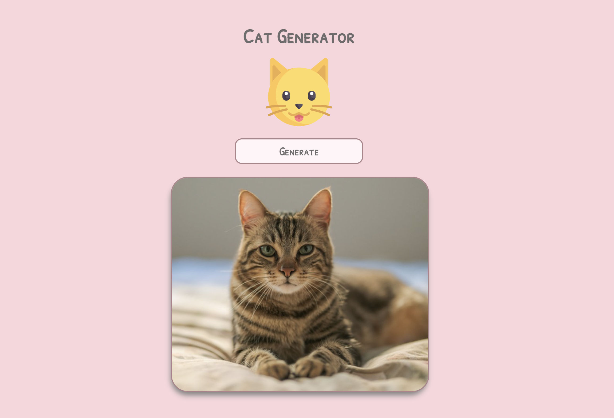

# Welcome to Cat Generator.

A tech application made to retrieve data from an API endpoint which is then rendered on a web page using React.js, node.js and JavaScript outside of the browser. 

The user will initially be located tp http://localhost:3000/ after commanding 'npm start' in the terminal to get the application running. 

When the user will be directed to the live server where the page of the UI is displayed, the user can have the option to view various imagery of various cats by clicking onto a generate button where various images are retrieved using an api url.

The user will have the benefit to view some animations when clicking onto the generate button and the color scheme was used to give off a playful vibe for a friendly user experience.

# live server display


# Setup instructions

Clone this repository

```sh
$ git clone https://github.com/BAZBOT123/cat-api.git && cd cat-api
$ npm ci # install dependencies
$ npm start
# then point your browser to localhost:3000
```
